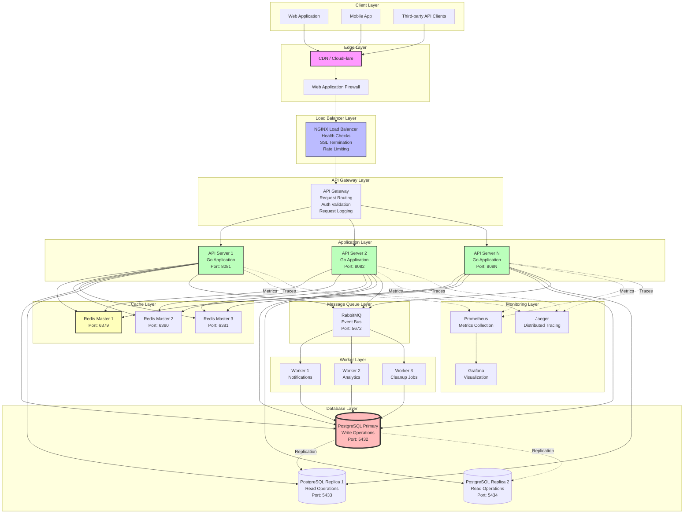
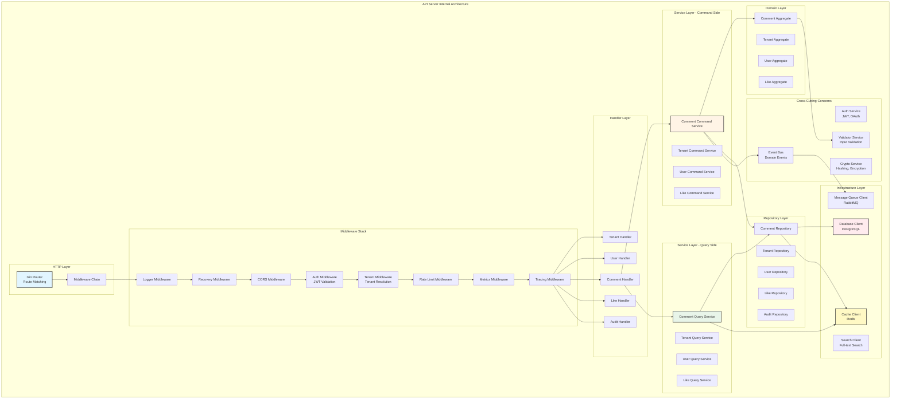
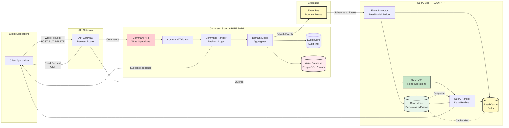
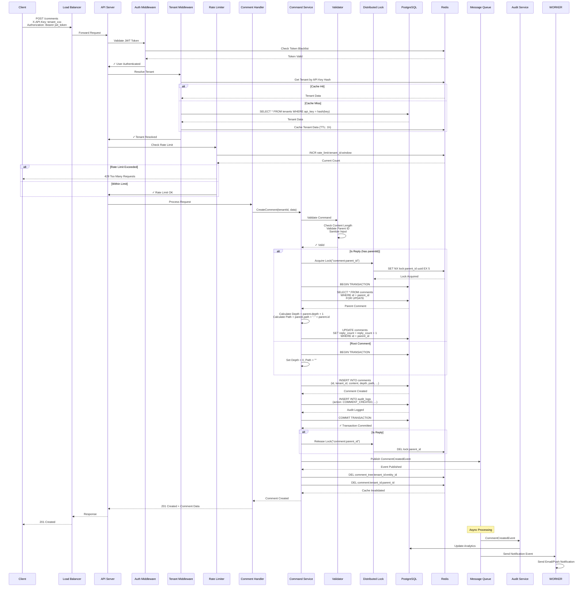
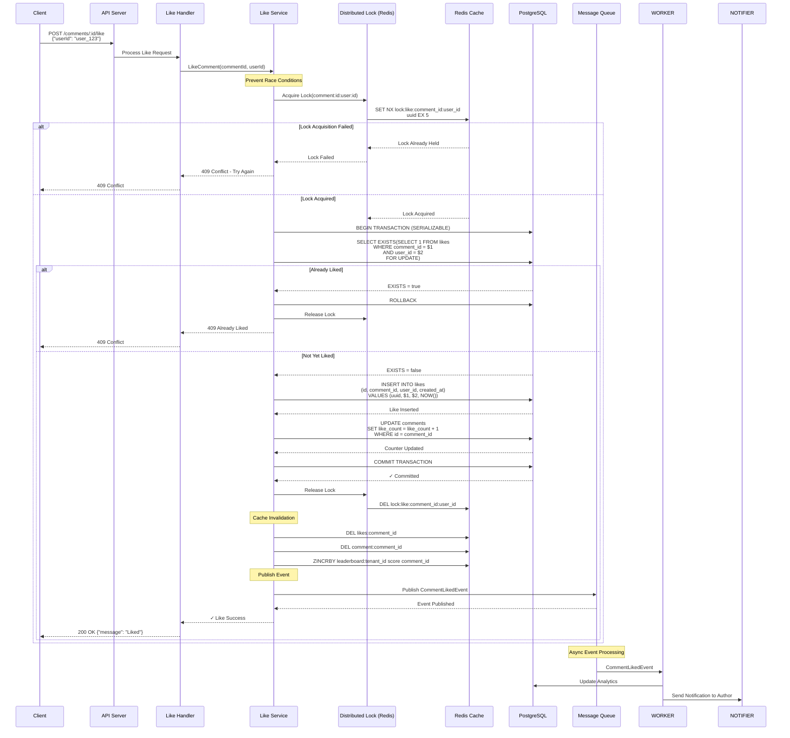
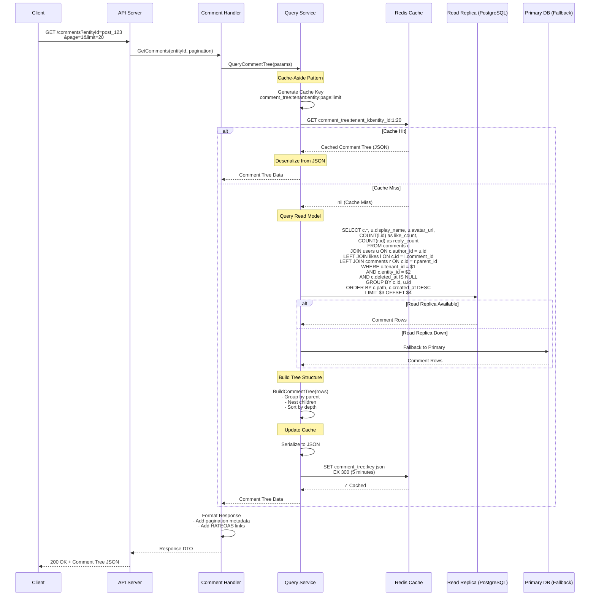
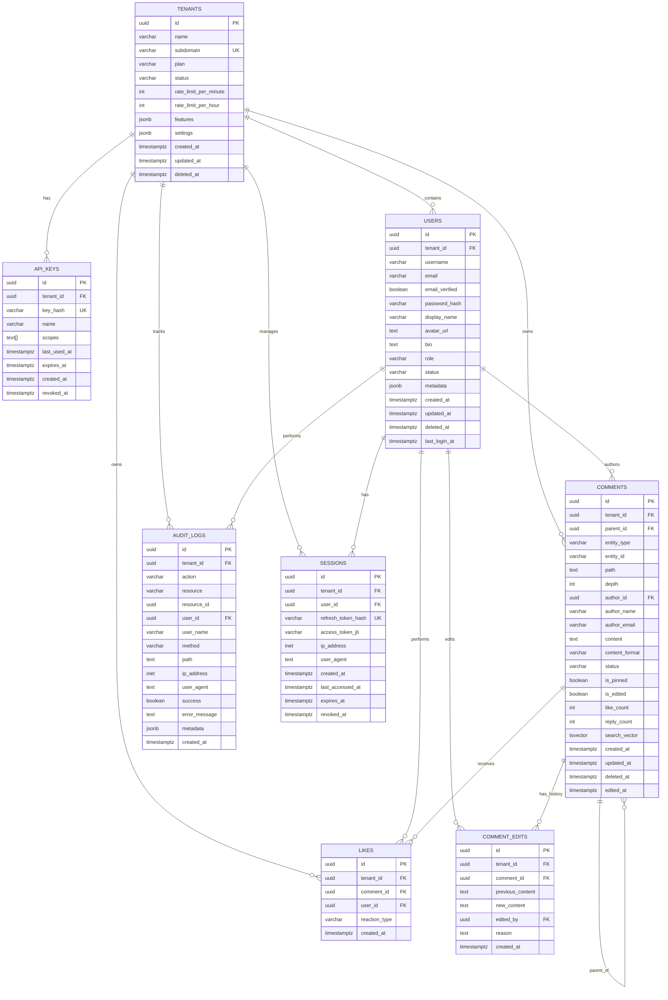
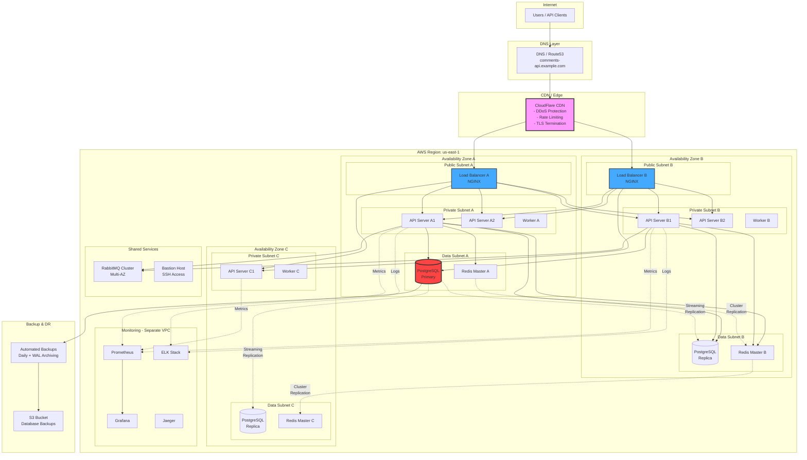
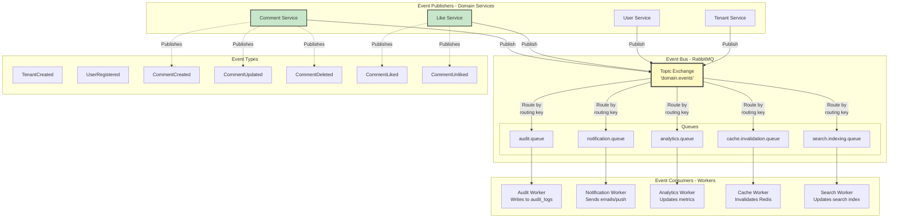

# System Architecture Diagrams
## Enterprise Comments SaaS Platform

---

## 1. HIGH-LEVEL SYSTEM ARCHITECTURE



---

## 2. DETAILED COMPONENT ARCHITECTURE



---

## 3. CQRS ARCHITECTURE PATTERN



---

## 4. REQUEST FLOW SEQUENCE DIAGRAM - CREATE COMMENT



---

## 5. REQUEST FLOW - LIKE/UNLIKE COMMENT



---

## 6. READ REQUEST FLOW - GET COMMENT TREE (CQRS Query Side)



---

## 7. DATA FLOW DIAGRAM - MULTI-TENANT ISOLATION

```mermaid
graph TB
    subgraph "Request Entry"
        REQ[Incoming Request<br/>X-API-Key: tenant_abc123]
    end

    subgraph "Tenant Resolution"
        HASH[Hash API Key<br/>SHA-256]
        LOOKUP[Lookup Tenant<br/>Redis/Database]
        VALIDATE[Validate Tenant Status<br/>Check: ACTIVE, rate limits]
    end

    subgraph "Request Context"
        CTX[Request Context<br/>tenant_id: uuid-1234<br/>user_id: uuid-5678<br/>scopes: [read, write]]
    end

    subgraph "Data Access Layer - Automatic Tenant Filtering"
        subgraph "Repository Pattern"
            REPO[Repository Methods]
            FILTER[Auto-inject WHERE tenant_id = $1]
        end
        
        subgraph "Database Queries"
            QUERY1[SELECT * FROM comments<br/>WHERE tenant_id = 'uuid-1234'<br/>AND entity_id = 'post_xyz']
            QUERY2[INSERT INTO comments<br/>VALUES ('uuid-1234', ...)]
            QUERY3[UPDATE comments<br/>SET content = $1<br/>WHERE id = $2<br/>AND tenant_id = 'uuid-1234']
        end
    end

    subgraph "Cache Isolation - Key Namespacing"
        CACHE_KEY[Cache Key Pattern<br/>{tenant_id}:{resource}:{id}]
        EXAMPLES[Examples:<br/>uuid-1234:comment:abc<br/>uuid-1234:likes:abc<br/>uuid-1234:session:xyz]
    end

    subgraph "Security Enforcement"
        CHECK1[Verify tenant ownership<br/>before any operation]
        CHECK2[Return 404 if resource<br/>belongs to different tenant]
        CHECK3[Never expose tenant_id<br/>in error messages]
    end

    REQ --> HASH
    HASH --> LOOKUP
    LOOKUP --> VALIDATE
    VALIDATE --> CTX
    
    CTX --> REPO
    REPO --> FILTER
    FILTER --> QUERY1
    FILTER --> QUERY2
    FILTER --> QUERY3
    
    CTX --> CACHE_KEY
    CACHE_KEY --> EXAMPLES
    
    FILTER --> CHECK1
    CHECK1 --> CHECK2
    CHECK2 --> CHECK3

    style REQ fill:#e3f2fd,stroke:#333,stroke-width:2px
    style CTX fill:#fff9c4,stroke:#333,stroke-width:3px
    style FILTER fill:#ffcdd2,stroke:#333,stroke-width:2px
    style CACHE_KEY fill:#c8e6c9,stroke:#333,stroke-width:2px
```

---

## 8. DATABASE SCHEMA ENTITY RELATIONSHIP DIAGRAM



---

## 9. REDIS DATA STRUCTURE ARCHITECTURE

```mermaid
graph TB
    subgraph "Redis Cluster Architecture"
        subgraph "Master Nodes"
            M1[Master 1<br/>Slots: 0-5460<br/>Port: 6379]
            M2[Master 2<br/>Slots: 5461-10922<br/>Port: 6380]
            M3[Master 3<br/>Slots: 10923-16383<br/>Port: 6381]
        end
        
        subgraph "Replica Nodes"
            R1[Replica 1<br/>→ Master 1<br/>Port: 6382]
            R2[Replica 2<br/>→ Master 2<br/>Port: 6383]
            R3[Replica 3<br/>→ Master 3<br/>Port: 6384]
        end
    end
    
    M1 -.Replicate.-> R1
    M2 -.Replicate.-> R2
    M3 -.Replicate.-> R3
    
    subgraph "Data Structures by Use Case"
        subgraph "Session Management"
            S1[Key: session:{session_id}<br/>Type: Hash<br/>Fields: user_id, tenant_id,<br/>created_at, expires_at<br/>TTL: 24 hours]
        end
        
        subgraph "Rate Limiting"
            S2[Key: rate_limit:{tenant}:{window}<br/>Type: String<br/>Value: Counter<br/>TTL: Window duration<br/>Operations: INCR, EXPIRE]
        end
        
        subgraph "Caching - Comments"
            S3[Key: comment:{tenant}:{id}<br/>Type: String JSON<br/>Value: Comment object<br/>TTL: 1 hour]
            S4[Key: comment_tree:{tenant}:{entity}<br/>Type: String JSON<br/>Value: Tree structure<br/>TTL: 5 minutes]
        end
        
        subgraph "Caching - Counts"
            S5[Key: likes:{comment_id}<br/>Type: String<br/>Value: Like count<br/>TTL: 5 minutes]
        end
        
        subgraph "Distributed Locks"
            S6[Key: lock:{resource}<br/>Type: String<br/>Value: Lock UUID<br/>TTL: 5 seconds<br/>Operation: SET NX EX]
        end
        
        subgraph "Leaderboards"
            S7[Key: leaderboard:{tenant}:{type}<br/>Type: Sorted Set<br/>Score: engagement_score<br/>Member: comment_id<br/>Operations: ZADD, ZRANGE]
        end
        
        subgraph "Pub/Sub - Real-time"
            S8[Channel: notifications:{tenant}:{user}<br/>Type: Pub/Sub<br/>Payload: JSON events<br/>Operations: PUBLISH, SUBSCRIBE]
        end
        
        subgraph "Token Blacklist"
            S9[Key: revoked:{jti}<br/>Type: String<br/>Value: 1<br/>TTL: Token expiry duration]
        end
        
        subgraph "Tenant Cache"
            S10[Key: tenant:{api_key_hash}<br/>Type: Hash<br/>Fields: id, name, plan,<br/>rate_limits<br/>TTL: 1 hour]
        end
    end
    
    M1 --> S1
    M1 --> S2
    M2 --> S3
    M2 --> S4
    M3 --> S5
    M3 --> S6
    M1 --> S7
    M2 --> S8
    M3 --> S9
    M1 --> S10

    style M1 fill:#ffcdd2,stroke:#333,stroke-width:2px
    style M2 fill:#ffcdd2,stroke:#333,stroke-width:2px
    style M3 fill:#ffcdd2,stroke:#333,stroke-width:2px
    style R1 fill:#e1f5fe,stroke:#333,stroke-width:1px
    style R2 fill:#e1f5fe,stroke:#333,stroke-width:1px
    style R3 fill:#e1f5fe,stroke:#333,stroke-width:1px
```

---

## 10. DEPLOYMENT ARCHITECTURE - PRODUCTION



---

## 11. EVENT-DRIVEN ARCHITECTURE FLOW



---

## Summary

These diagrams cover:

1. **High-Level System Architecture** - Complete infrastructure view
2. **Component Architecture** - Internal API server structure
3. **CQRS Pattern** - Separation of read/write concerns
4. **Create Comment Sequence** - Detailed step-by-step flow
5. **Like/Unlike Flow** - Race condition prevention
6. **Query Flow (CQRS)** - Cache-aside pattern
7. **Multi-Tenant Isolation** - Security enforcement
8. **Database ERD** - Complete schema relationships
9. **Redis Architecture** - Cluster setup and data structures
10. **Production Deployment** - Multi-AZ, high availability
11. **Event-Driven Flow** - Async processing architecture

Each diagram shows different aspects of the system at various levels of detail, from high-level architecture down to specific request flows.